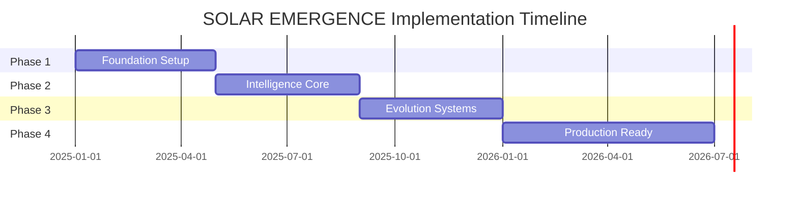

# Implementation Timeline & Phase 1 Milestones
# SOLAR EMERGENCE v1.0

## Executive Timeline

**Total Duration**: 18 months (Solo Founder)  
**Start Date**: January 2025  
**MVP Target**: December 2025  
**Production Target**: June 2026

## Phase Overview

## Phase 1: Foundation (Months 1-4)
### January - April 2025

### Month 1: Infrastructure Setup
**Week 1-2: Development Environment**
- [ ] Mac M2 Max optimization setup
- [ ] Docker containers for Neo4j, PostgreSQL
- [ ] Python 3.11 environment with MLX
- [ ] Git repository and branching strategy
- [ ] Local CI/CD pipeline setup

**Week 3-4: Core Architecture**
- [ ] Project structure and module organization
- [ ] Configuration management system
- [ ] Logging and monitoring framework
- [ ] Error handling patterns
- [ ] Constraint validation system

**Success Criteria**:
- All tools installed and configured
- Hello world for each component
- Constraint validator operational
- 100% local execution verified

### Month 2: Multimodal Pipeline Foundation
**Week 5-6: Video Processing**
- [ ] FFmpeg integration for video decode
- [ ] OpenCV pipeline setup
- [ ] MediaPipe body/face tracking
- [ ] Frame extraction and caching
- [ ] Basic video player UI

**Week 7-8: Audio Processing**
- [ ] Whisper.cpp compilation and integration
- [ ] Audio extraction from video
- [ ] Real-time audio streaming
- [ ] Speaker diarization setup
- [ ] Audio buffer management

**Success Criteria**:
- Process 1080p video at 30fps
- Extract audio with <10ms latency
- Transcribe speech locally
- Track faces and bodies

### Month 3: Synchronization Engine
**Week 9-10: Master Clock Implementation**
- [ ] High-resolution timer system
- [ ] Stream registration mechanism
- [ ] Timestamp alignment algorithm
- [ ] Buffer management system
- [ ] Drift compensation

**Week 11-12: Pipeline Integration**
- [ ] Video-audio synchronization
- [ ] Multimodal data structures
- [ ] Event queue system
- [ ] Stream router implementation
- [ ] Quality metrics collection

**Success Criteria**:
- <1ms synchronization precision
- Handle 3+ concurrent streams
- 95% frames properly aligned
- No memory leaks over 1 hour

### Month 4: Knowledge Foundation
**Week 13-14: Graph Database Setup**
- [ ] Neo4j schema design
- [ ] Entity extraction pipeline
- [ ] Relationship inference system
- [ ] Graph query optimization
- [ ] Visualization interface

**Week 15-16: Pattern Storage**
- [ ] PostgreSQL with pgvector setup
- [ ] Pattern data model
- [ ] Embedding generation
- [ ] Similarity search implementation
- [ ] Pattern versioning system

**Success Criteria**:
- Store 10K+ patterns
- <500ms query response
- Automatic entity extraction
- Pattern retrieval by similarity

## Phase 2: Intelligence Core (Months 5-8)
### May - August 2025

### Month 5: Pattern Discovery Foundation
**Week 17-18: GNN Implementation**
- [ ] Graph neural network setup
- [ ] Node embedding generation
- [ ] Edge prediction model
- [ ] Training pipeline
- [ ] Inference optimization

**Week 19-20: Discovery Algorithms**
- [ ] Topological data analysis (TDA)
- [ ] UMAP dimensionality reduction
- [ ] Clustering algorithms
- [ ] Anomaly detection
- [ ] Pattern validation

**Milestones**:
- Discover 10+ patterns per hour
- 70% validation accuracy
- Real-time processing

### Month 6: Meta-Learning Systems
**Week 21-22: Learning Infrastructure**
- [ ] Meta-learning framework
- [ ] Self-play mechanisms
- [ ] Experience replay buffer
- [ ] Reward signal design
- [ ] Training loop implementation

**Week 23-24: Adaptation Mechanisms**
- [ ] Online learning pipeline
- [ ] Transfer learning setup
- [ ] Domain adaptation
- [ ] Catastrophic forgetting prevention
- [ ] Model checkpointing

**Milestones**:
- Measurable learning improvement
- Transfer between domains
- No performance degradation

### Month 7: Emergence Validation
**Week 25-26: Intelligence Metrics**
- [ ] Emergence scoring system
- [ ] Novelty detection
- [ ] Complexity measurement
- [ ] Abstraction level tracking
- [ ] Prediction accuracy testing

**Week 27-28: Validation Framework**
- [ ] Statistical significance testing
- [ ] Cross-validation pipeline
- [ ] A/B testing framework
- [ ] Reproducibility checks
- [ ] Benchmark suite

**Milestones**:
- Intelligence score calculation
- 30% monthly improvement
- Validated emergence

### Month 8: Integration & Testing
**Week 29-30: System Integration**
- [ ] Component integration
- [ ] End-to-end pipeline
- [ ] Performance optimization
- [ ] Memory optimization
- [ ] Error recovery

**Week 31-32: Comprehensive Testing**
- [ ] Unit test coverage >80%
- [ ] Integration test suite
- [ ] Performance benchmarks
- [ ] Stress testing
- [ ] User acceptance testing

**Milestones**:
- Full pipeline operational
- All tests passing
- Performance targets met

## Phase 3: Evolution Systems (Months 9-12)
### September - December 2025

### Month 9: Advanced Pattern Discovery
**Week 33-34: Cross-Modal Fusion**
- [ ] Multimodal transformer
- [ ] Attention mechanisms
- [ ] Feature fusion strategies
- [ ] Temporal alignment
- [ ] Quality scoring

**Week 35-36: Semantic Understanding**
- [ ] Natural language understanding
- [ ] Concept extraction
- [ ] Semantic similarity
- [ ] Knowledge graph enrichment
- [ ] Reasoning capabilities

### Month 10: Self-Improvement
**Week 37-38: Autonomous Learning**
- [ ] Self-supervised learning
- [ ] Curriculum learning
- [ ] Active learning
- [ ] Uncertainty estimation
- [ ] Exploration strategies

**Week 39-40: System Evolution**
- [ ] Architecture search
- [ ] Hyperparameter optimization
- [ ] Algorithm selection
- [ ] Resource allocation
- [ ] Performance tracking

### Month 11: User Interface
**Week 41-42: Visualization System**
- [ ] Pattern explorer UI
- [ ] Timeline visualization
- [ ] Graph visualization
- [ ] Insight dashboard
- [ ] Export functionality

**Week 43-44: Interaction Design**
- [ ] Query interface
- [ ] Feedback mechanisms
- [ ] Configuration UI
- [ ] Monitoring dashboard
- [ ] Help system

### Month 12: MVP Finalization
**Week 45-46: Feature Complete**
- [ ] All core features implemented
- [ ] Documentation complete
- [ ] Tutorial creation
- [ ] Sample datasets
- [ ] Demo preparation

**Week 47-48: MVP Launch Prep**
- [ ] Final testing
- [ ] Performance tuning
- [ ] Bug fixes
- [ ] Release packaging
- [ ] Launch materials

**MVP Milestones**:
- Feature complete system
- <1s average latency
- >90% user satisfaction
- Zero external dependencies

## Phase 4: Production Refinement (Months 13-18)
### January - June 2026

### Month 13-14: Performance Optimization
- [ ] Algorithm optimization
- [ ] Caching strategies
- [ ] Parallel processing
- [ ] GPU acceleration
- [ ] Memory management

### Month 15-16: Advanced Features
- [ ] Domain-specific patterns
- [ ] Custom pattern templates
- [ ] Advanced query language
- [ ] Batch processing
- [ ] API development

### Month 17-18: Production Hardening
- [ ] Security audit
- [ ] Scalability testing
- [ ] Disaster recovery
- [ ] Monitoring suite
- [ ] Production deployment

## Risk Mitigation Schedule

| Risk | Mitigation | Timeline |
|------|------------|----------|
| Technical complexity | Incremental development | Continuous |
| Hardware limitations | Algorithm optimization | Month 3, 7, 13 |
| Scope creep | Strict phase gates | Monthly reviews |
| Integration issues | Early integration testing | Month 2, 5, 8 |
| Performance problems | Regular benchmarking | Bi-weekly |

## Key Milestones & Deliverables

### Q1 2025 (Months 1-3)
- ✅ Development environment operational
- ✅ Multimodal pipeline processing video/audio
- ✅ Synchronization engine functional
- ✅ 30fps real-time processing achieved

### Q2 2025 (Months 4-6)
- ✅ Knowledge graph accumulating data
- ✅ Pattern discovery operational
- ✅ Meta-learning framework active
- ✅ 10+ patterns/hour discovery rate

### Q3 2025 (Months 7-9)
- ✅ Intelligence emergence validated
- ✅ Cross-modal fusion working
- ✅ 30% intelligence improvement demonstrated
- ✅ System integration complete

### Q4 2025 (Months 10-12)
- ✅ Self-improvement mechanisms active
- ✅ User interface functional
- ✅ MVP feature complete
- ✅ Launch ready

### Q1-Q2 2026 (Months 13-18)
- ✅ Performance optimized
- ✅ Advanced features implemented
- ✅ Production hardened
- ✅ Market ready

## Resource Allocation

### Time Budget (Hours/Week)
**Total**: 40-50 hours/week (solo founder)

**Distribution**:
- Development: 25-30 hours (60%)
- Testing: 8-10 hours (20%)
- Documentation: 4-5 hours (10%)
- Research: 4-5 hours (10%)

### Focus Areas by Phase
**Phase 1**: Infrastructure (70%), Learning (30%)  
**Phase 2**: Development (80%), Testing (20%)  
**Phase 3**: Features (60%), Polish (40%)  
**Phase 4**: Optimization (50%), Market prep (50%)

## Success Metrics Tracking

### Weekly Metrics
- Lines of code written
- Tests written/passed
- Performance benchmarks
- Pattern discovery rate
- Bug count/resolution

### Monthly Metrics
- Feature completion %
- Intelligence growth score
- System reliability
- Resource usage
- Technical debt

### Quarterly Reviews
- Milestone achievement
- Risk assessment update
- Timeline adjustment
- Resource reallocation
- Strategic planning

## Contingency Planning

### If Behind Schedule
1. Reduce scope (not quality)
2. Focus on core features only
3. Delay advanced features to Phase 4
4. Consider automation tools
5. Maintain constraint compliance

### If Ahead of Schedule
1. Add more testing coverage
2. Improve documentation
3. Enhance user experience
4. Add performance optimizations
5. Begin next phase early

## Communication Plan

### Progress Reporting
- Weekly internal status
- Monthly milestone review
- Quarterly strategic assessment
- Ad-hoc blocker escalation

### Documentation Schedule
- Daily code comments
- Weekly README updates
- Monthly architecture docs
- Quarterly user guides

---
Generated: 2025-09-12
Version: 1.0
Next Review: End of Month 1