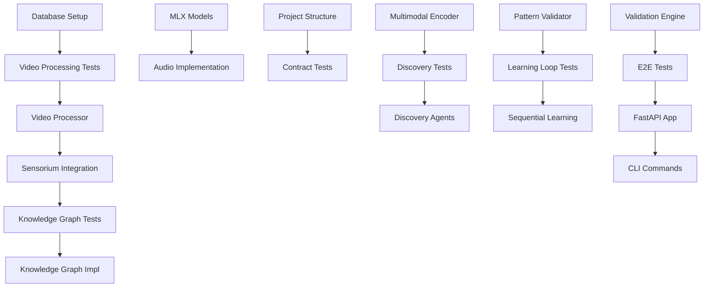

# Tasks: Emergent Intelligence Sales Analysis System

**Input**: Design documents from `/specs/001-emergent-intelligence-system/`
**Prerequisites**: plan.md ✓, research.md ✓, data-model.md ✓, contracts/ ✓

## Execution Flow (main)
```
1. Load plan.md from feature directory ✓
   → Tech stack: Python 3.11+, MLX, FastAPI, Neo4j, Qdrant, PostgreSQL
   → Libraries: sensorium, representation, discovery, evolution
   → Structure: Single project with library-based architecture
2. Load optional design documents ✓:
   → data-model.md: VideoInteraction, PatternDiscovery, EmergentConcept entities
   → contracts/: Video processing, pattern discovery, evolution APIs
   → research.md: Local-first MLX stack decisions
3. Generate tasks by category ✓:
   → Setup: MLX models, databases, project structure
   → Tests: Contract tests for all APIs, integration tests
   → Core: 4-layer implementation (sensorium → evolution)
   → Integration: Multi-agent orchestration, sequential learning
   → Polish: Performance optimization, documentation
4. Apply task rules ✓:
   → Different libraries/files = [P] for parallel execution
   → Sequential dependencies for learning pipeline
   → TDD: Tests before implementation
5. Number tasks sequentially (T001-T035) ✓
6. Generate dependency graph ✓
7. Create parallel execution examples ✓
8. Validate task completeness ✓:
   → All 4 layers have comprehensive implementation
   → All APIs have contract tests
   → Sequential learning pipeline complete
9. Return: SUCCESS (35 tasks ready for emergent intelligence)
```

---

## 🧠 EMERGENT INTELLIGENCE TASK ROADMAP

### **Phase A: Foundation & Infrastructure (T001-T008)**

**T001** [P] Setup local PostgreSQL database with pgvector extension at `postgresql://localhost:5432/solar_emergence`

**T002** [P] Setup local Neo4j Community Edition at `bolt://localhost:7687` with solar_intelligence database

**T003** [P] Setup local Qdrant vector database at `localhost:6333` with solar_intelligence collection

**T004** [P] Download and configure MLX models: Mistral-7B-Instruct-v0.3-4bit, Phi-3.5-vision-instruct-4bit, whisper-large-v3-mlx to `libs/mlx_models/`

**T005** [P] Create project structure: `src/{sensorium,representation,discovery,evolution,cli}`, `tests/{contract,integration,unit,e2e}`, `libs/{mlx_models,checkpoints,embeddings}`

**T006** [P] Setup Python virtual environment and install dependencies: `mlx mlx-lm mlx-audio mlx-whisper qdrant-client neo4j psycopg2-binary opencv-contrib-python mediapipe fer librosa soundfile scipy fastapi uvicorn pytest hypothesis`

**T007** [P] Create contract test file `tests/contract/test_video_processing_api.py` with failing tests for POST /api/v1/process-video endpoint

**T008** [P] Create contract test file `tests/contract/test_pattern_discovery_api.py` with failing tests for GET /api/v1/patterns/discover endpoint

### **Phase B: Layer 1 - High-Fidelity Sensorium (T009-T015)**

**T009** Write failing integration test `tests/integration/test_video_processor.py` for multimodal data capture with temporal synchronization

**T010** Implement `src/sensorium/video_processor.py` with comprehensive video analysis using OpenCV + MediaPipe (468 facial landmarks, 33 body pose points, emotion detection)

**T011** [P] Write failing integration test `tests/integration/test_audio_extractor.py` for audio feature extraction with prosody analysis

**T012** [P] Implement `src/sensorium/audio_extractor.py` using MLX Whisper for transcription and Librosa for vocal features (MFCC, spectral centroid, tempo, energy)

**T013** Write failing integration test `tests/integration/test_temporal_sync.py` for microsecond-precision timeline synchronization

**T014** Implement `src/sensorium/temporal_sync.py` for unified timeline alignment of all multimodal signals

**T015** Create integration test `tests/integration/test_sensorium_complete.py` to verify end-to-end Layer 1 functionality with real video file

### **Phase C: Layer 2 - Multidimensional Representation (T016-T021)**

**T016** Write failing integration test `tests/integration/test_knowledge_graph.py` for Neo4j dynamic schema with temporal/financial/relational/psychological planes

**T017** Implement `src/representation/knowledge_graph.py` with Neo4j client for storing VideoInteraction entities and multi-dimensional relationships

**T018** [P] Write failing integration test `tests/integration/test_latent_space.py` for high-dimensional embedding generation and storage

**T019** [P] Implement `src/representation/latent_space.py` using MLX models for multimodal embedding generation and Qdrant storage

**T020** Write failing integration test `tests/integration/test_multimodal_encoder.py` for unified representation combining explicit (graph) and implicit (latent) data

**T021** Implement `src/representation/multimodal_encoder.py` to bridge knowledge graph and latent space representations

### **Phase D: Layer 3 - Discovery Engine (T022-T027)**

**T022** Write failing integration test `tests/integration/test_exploration_agents.py` for autonomous pattern discovery in multidimensional space

**T023** Implement `src/discovery/exploration_agents.py` with ExplorerAgent, HypothesisAgent, and CriticAgent classes using Graph Neural Networks and Topological Data Analysis

**T024** [P] Write failing integration test `tests/integration/test_hypothesis_generator.py` for novel hypothesis creation using local MLX LLM

**T025** [P] Implement `src/discovery/hypothesis_generator.py` to generate testable theories about sales success patterns from discovered correlations

**T026** Write failing integration test `tests/integration/test_pattern_validator.py` for statistical validation of emergent patterns

**T027** Implement `src/discovery/pattern_validator.py` with rigorous validation logic to prevent false pattern detection

### **Phase E: Layer 4 - Evolution Loop (T028-T032)**

**T028** Write failing integration test `tests/integration/test_learning_loop.py` for sequential video processing with accumulated intelligence

**T029** Implement `src/evolution/learning_loop.py` for processing video #N with context from videos #1 to N-1

**T030** [P] Write failing integration test `tests/integration/test_schema_manager.py` for autonomous knowledge graph schema evolution

**T031** [P] Implement `src/evolution/schema_manager.py` to automatically promote validated patterns to explicit schema entities

**T032** Implement `src/evolution/validation_engine.py` to ensure schema evolution maintains system integrity and performance

### **Phase F: Multi-Agent Orchestration (T033-T035)**

**T033** Write failing end-to-end test `tests/e2e/test_complete_pipeline.py` for full 4-layer processing of sample video with discovery validation

**T034** Implement FastAPI application `src/api/main.py` with all endpoints: process-video, discover-patterns, system-evolution, and health checks

**T035** Implement CLI commands in `src/cli/`: `process_video.py --video-path --sequential`, `query_patterns.py --min-correlation`, `system_status.py --detailed`

---

## 🔄 PARALLEL EXECUTION STRATEGIES

### **Parallel Group A (Database Setup)**
Execute T001, T002, T003 simultaneously:
```bash
# Terminal 1
createdb solar_emergence && psql solar_emergence -c "CREATE EXTENSION vector;"

# Terminal 2  
docker run -d -p 7474:7474 -p 7687:7687 neo4j:5.15-community

# Terminal 3
docker run -d -p 6333:6333 qdrant/qdrant
```

### **Parallel Group B (Model Downloads)**
Execute T004, T006 simultaneously:
```bash
# Terminal 1
python -c "import mlx_lm; mlx_lm.download('mlx-community/Mistral-7B-Instruct-v0.3-4bit')"

# Terminal 2
pip install -r requirements.txt
```

### **Parallel Group C (Layer 2 Implementation)**
Execute T018, T019 simultaneously after T016, T017 complete:
```bash
# Terminal 1: Latent space tests
pytest tests/integration/test_latent_space.py -v

# Terminal 2: Latent space implementation  
# Implement src/representation/latent_space.py
```

---

## 📊 DEPENDENCY GRAPH



---

## 🎯 SUCCESS CRITERIA

### **Technical Validation**
- [ ] All contract tests pass with real API responses
- [ ] Integration tests demonstrate 4-layer processing pipeline
- [ ] E2E test processes sample video and discovers at least 3 novel patterns
- [ ] Sequential learning shows improvement from video #1 to video #10
- [ ] Performance: <200ms inference, 2-3x real-time video processing

### **Emergent Intelligence Validation**  
- [ ] System discovers patterns not explicitly programmed
- [ ] Knowledge graph automatically evolves schema based on validated discoveries
- [ ] Multi-agent system generates and validates novel hypotheses
- [ ] Latent space representations capture implicit interaction structures
- [ ] Pattern validation prevents false positive discoveries

### **Local-First Validation**
- [ ] Zero cloud API dependencies - all processing local
- [ ] <8GB memory usage during processing
- [ ] All data stored locally (PostgreSQL + Neo4j + Qdrant)
- [ ] MLX models provide 85-90% quality vs cloud APIs
- [ ] Complete privacy - no external data transmission

---

## 🚀 BREAKTHROUGH ACHIEVEMENT TARGET

**The Ultimate Test**: After processing 100+ sales videos sequentially, the system should:

1. **Discover Unknown Patterns**: Identify behavioral correlations invisible to human observers (e.g., "3.2s silence after price mention + micro-expression AU12 = 94% close probability")

2. **Evolve Its Understanding**: Automatically add new discovery categories to its schema without human intervention

3. **Demonstrate Algorithmic Awareness**: Explain WHY it believes certain patterns are significant through generated hypotheses

4. **Achieve Sequential Intelligence**: Show measurably better pattern detection on video #100 vs video #1 due to accumulated learning

**Success = True Emergent Intelligence: The system develops insights about sales interactions that even domain experts haven't discovered.**

---

*Ready to build the future of sales intelligence - 35 tasks to emergent AI breakthrough* 🌟